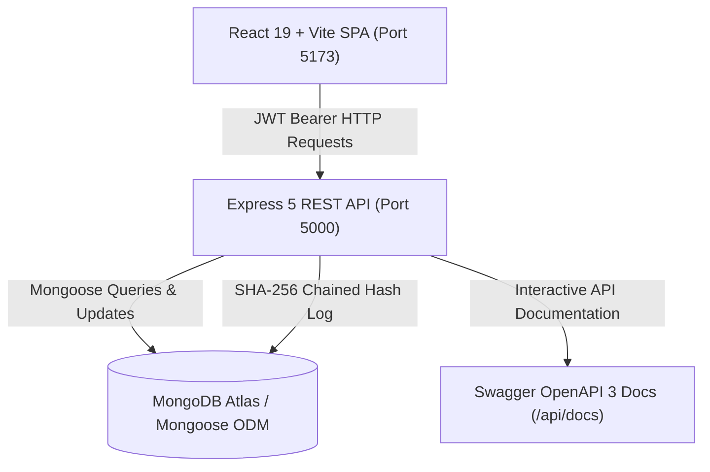

# BCA-05: Explainable Alumni-Mentor Matching Marketplace with Capacity-Aware Recommendations

> **BCA Capstone Project — Final Year**  
> **Tech Stack:** React 19 + Vite, Node.js + Express 5, MongoDB Atlas + Mongoose, JWT Authentication, Swagger UI / OpenAPI 3.

---

## 1. Project Overview

**MentorConnect (BCA-05)** is a full-stack alumni-student mentorship marketplace engineered to solve key challenges in higher-education mentorship programs:

1. **Explainable Matchmaking Engine:** Eliminates "black-box" recommendations with a **100% transparent, deterministic match scoring algorithm** with clear factor breakdowns (Skills 45%, Interests 20%, Goals 15%, Languages 10%, Availability 5%, Capacity 5%).
2. **Mentor Capacity & Burnout Prevention:** Mentors set concurrent mentee limits (1–6 students). The backend enforces **atomic concurrency guards** in MongoDB (`findOneAndUpdate` with `$expr`), preventing race conditions and over-allocation.
3. **Session Scheduling & Availability Management:** Mentors publish recurring availability slots. Students select from available slots, with server-side validation preventing double bookings, overlapping sessions, and past bookings.
4. **Milestone Goals & Progress Tracking:** Comprehensive goal-tracking system allowing students and mentors to create milestone targets, monitor progress percentage (0–100%), edit details, and delete goals.
5. **Multi-Aspect Feedback & Reviews:** Students submit 1–5 star ratings, detailed comments, and aspect-specific evaluations (Usefulness of Advice, Clarity of Guidance, Communication & Comfort). Mentors and administrators receive aggregated performance and satisfaction metrics.
6. **In-App Notification Center:** Automated in-app notifications keep students and mentors updated on mentorship request status, new meeting sessions, and milestone progress.
7. **Tamper-Evident Audit Ledger:** Cryptographic SHA-256 chained event log recording critical institutional actions (mentor verification, account status changes, and administrative actions).

---

## 2. Tech Stack & Tools Used

### Frontend
- **Framework & Build Tool:** React 19 Single Page Application built with Vite
- **Routing:** React Router v6 with role-based route protection (`/student`, `/mentor`, `/admin`)
- **Icons & UI:** Lucide React icons with a custom, responsive CSS design system
- **Testing:** Vitest & React Testing Library (82 unit and integration tests across 15 test suites)

### Backend
- **Runtime & Framework:** Node.js & Express 5 REST API
- **Database & ODM:** MongoDB Atlas with Mongoose 8
- **Authentication & Security:** JWT (JSON Web Tokens), bcryptjs password hashing, Helmet security headers, CORS, and Express Rate Limit
- **API Documentation:** Swagger UI (`swagger-ui-express`) with OpenAPI 3 specification at `/api/docs`
- **Testing:** Node Test Runner (`node:test`) & Supertest

---

## 3. Features by User Role

### 🎓 Student Features
- **Mentor Discovery & Search:** Browse and filter verified mentors by domain, technical skills, company, and languages.
- **Explainable Match Scores:** View itemized alignment percentages across all criteria before sending a request.
- **Mentorship Requests:** Submit customized mentorship inquiries with goals and statement of purpose.
- **Session Scheduling:** View mentor availability calendar and book non-conflicting 1-on-1 mentorship sessions.
- **Milestone Goals Tracking:** Add milestones, track completion percentage, edit targets, and delete completed/outdated goals.
- **Review & Feedback Submission:** Rate mentors (1–5 stars) with comments and 3 aspect ratings (Advice Usefulness, Clarity of Guidance, Communication Comfort).
- **Notification Hub:** View in-app notifications for request status and meeting updates.

### 💼 Alumni Mentor Features
- **Capacity Controls:** Define maximum concurrent mentees (1–6 students) enforced with atomic database guards.
- **Request Management:** Review incoming student mentorship requests and accept or decline with notes.
- **Availability & Session Hub:** Configure weekly availability slots, accept meetings, and manage schedule.
- **Mentee Milestone Management:** Track active mentees, set milestone goals, update progress, edit, and delete targets.
- **Feedback & Reviews Hub:** View student ratings, average satisfaction scores, and aspect breakdowns.
- **Notification Hub:** Receive alerts when new inquiries, bookings, or reviews are submitted.

### 🛡️ Administrator Features
- **Governance Dashboard:** Platform-wide metrics, active mentorship pairs, and total completed sessions.
- **Mentor Verification Queue:** Inspect mentor credentials, graduation year, job title, and employer before approving.
- **User Management:** Search, view, and activate/deactivate student and mentor accounts.
- **Funnel Analytics:** Track inquiry pipeline (Total Inquiries, Accepted, Pending, Declined, Withdrawn) and domain trends.
- **Cryptographic Audit Ledger:** View immutable SHA-256 chained activity logs with verification hashes.

---

## 4. Explainable Matching Algorithm

The matching engine computes a deterministic, normalized affinity score $S \in [0, 100]$:

$$\text{Score} = \sum_{i} w_i \cdot \text{RawScore}_i$$

| Factor | Weight ($w_i$) | Evaluation Method |
|---|---|---|
| **Skills Overlap** | 45% (0.45) | Normalized overlap of student skills and mentor skills |
| **Interests / Domain** | 20% (0.20) | Intersection of student target domain & mentor domain |
| **Goals Alignment** | 15% (0.15) | Alignment between student growth targets & mentor offerings |
| **Languages** | 10% (0.10) | Common spoken communication languages |
| **Availability** | 5% (0.05) | Overlapping day/time availability slots |
| **Capacity** | 5% (0.05) | Full credit if $\text{currentMentees} < \text{capacity}$; 0% if at capacity |

Every match generates an immutable `matchSnapshot` saved with the mentorship request, providing transparent natural-language rationale for every recommendation.

---

## 5. System Architecture



---

## 6. Getting Started & Running Locally

### Prerequisites
- **Node.js:** v20+ or v22+ (LTS recommended)
- **MongoDB:** MongoDB Atlas connection string (or local MongoDB on `mongodb://localhost:27017`)
- **Git**

### Step 1: Clone the Repository
```bash
git clone https://github.com/Abhishek-18-abhi/Alumni-Mentor-Project.git
cd Alumni-Mentor-Project
```

### Step 2: Install Dependencies
```bash
# Install frontend dependencies
npm install

# Install backend dependencies
cd backend
npm install
cd ..
```

### Step 3: Configure Environment Variables

1. **Frontend `.env` (in root directory):**
   ```env
   VITE_API_URL=http://localhost:5000/api
   ```

2. **Backend `.env` (in `backend/` directory):**
   ```env
   PORT=5000
   MONGODB_URI=mongodb+srv://<username>:<password>@cluster.mongodb.net/alumni-mentor?retryWrites=true&w=majority
   JWT_SECRET=your_jwt_secret_key_at_least_32_characters_long
   CLIENT_URL=http://localhost:5173
   ```

### Step 4: Start the Application

1. **Start the Backend API (Port 5000):**
   ```bash
   cd backend
   npm run dev
   ```

2. **Start the Frontend (Port 5173):**
   Open a separate terminal in the root directory:
   ```bash
   npm run dev
   ```

3. **Access the Application:**
   - **Frontend App:** `http://localhost:5173`
   - **Backend API:** `http://localhost:5000/api`
   - **Healthcheck:** `http://localhost:5000/api/health`
   - **Swagger API Docs:** `http://localhost:5000/api/docs`

---

## 7. Testing & Verification

The project includes unit, component, and integration tests:

```bash
# Run Frontend Vitest Suite (82 tests across 15 test suites)
npm test

# Run Backend Tests (Node Test Runner + Supertest)
cd backend && npm test
```

### Verified Test Suites
- **Route Authorization:** Verifies role-based route protection for Student, Mentor, and Admin workspaces.
- **Capacity & Booking Validation:** Automated race-condition tests, double-booking rejection, and past-date rejection.
- **Explainable Matching Engine:** Factor calculation, weights summing to 1.0, and boundary tests.
- **Goals & Milestone Management:** Milestone creation, progress updates, edit, and deletion logic.
- **Feedback & Review System:** Multi-aspect review submission and role-based feedback isolation.
- **UI Components:** Unit tests for ChipPicker, TabBar, ScoreBreakdown, StatusChip, and ErrorBoundary.

---

## 8. Security & Academic Integrity
- **Environment-Driven Secrets:** All database URIs, ports, and JWT signing keys are managed securely via `.env` files.
- **Role-Based Access Control (RBAC):** Every mutating API endpoint validates the user's JWT token and role (`student`, `mentor`, `admin`).
- **Data Protection:** Passwords securely hashed with `bcryptjs` (salt factor 10); private emails stripped from public mentor/student listings.
- **Atomic Concurrency Protection:** Mentor capacity limits enforced with atomic database operations to prevent race conditions.
