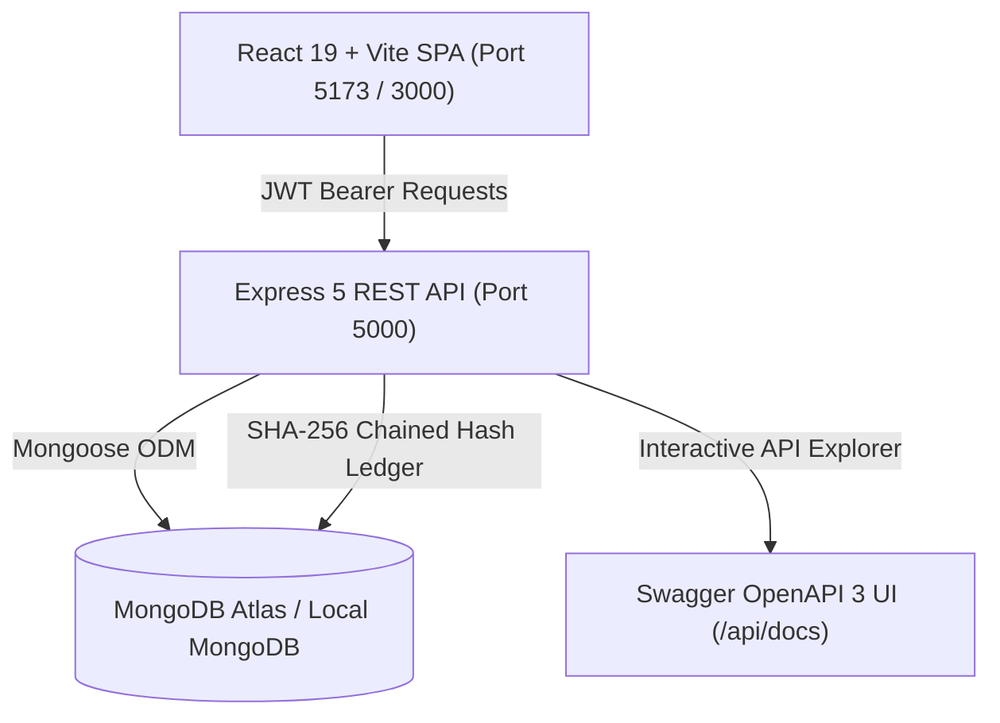

# BCA-05: Explainable Alumni-Mentor Matching Marketplace with Capacity-Aware Recommendations

> **Capstone Project BCA-05**  
> **Tech Stack:** React 19 + Vite, Node.js 22 + Express 5, MongoDB Atlas + Mongoose, JWT Auth, Docker, OpenAPI 3 / Swagger.

---

## 1. Project Overview

**MentorConnect (BCA-05)** is a full-stack, enterprise-grade alumni-student mentorship marketplace engineered to solve critical bottlenecks in higher-education mentorship programmes:

1. **Explainable Matchmaking Engine:** Eliminates "black-box" recommendations with a **100% transparent and explainable match scoring algorithm** with audited factor breakdowns (Skills 45%, Interests 20%, Goals 15%, Languages 10%, Availability 5%, Capacity 5%).
2. **Mentor Burnout & Capacity Guardrails:** Mentors define explicit concurrent mentee limits. The backend enforces **atomic concurrency guards** (`findOneAndUpdate` with `$expr`), mathematically preventing concurrent acceptances from exceeding capacity.
3. **Double-Booking & Availability Safeguards:** Server-side bidirectional scheduling ensures mentorship sessions fall strictly within published availability slots, blocking past bookings and overlapping slots for both participants.
4. **Milestone Goals & Accountability:** Comprehensive student and mentor goal-tracking system supporting milestone creation, progress updates (0–100%), full editing, and deletion.
5. **Two-Way Feedback & Continuous Quality:** Students select connected mentors to submit star ratings, written reviews, and detailed aspect evaluations (Usefulness of Advice, Clarity of Guidance, Communication & Comfort). Mentors and administrators receive real-time performance insights.
6. **Cryptographic Audit Ledger:** An immutable SHA-256 hash-chained event ledger guarantees data provenance for mentor approvals, account status shifts, and role changes.

---

## 2. Key Features by Role

### 🎓 Student Workspace
- **Smart Discovery & Search:** Filter verified mentors by company, technical domain, skills, and languages.
- **Explainable Match Score:** View itemized alignment percentages for every factor before requesting mentorship.
- **Mentorship Requests:** Submit customized mentorship inquiries with goals and statements of purpose.
- **Interactive Calendar & Booking:** Browse published mentor availability slots and schedule meetings.
- **Milestone Goals Tracking:** Define targets, track percentage completion, edit milestones, and delete completed/outdated items.
- **Mentor Reviews & Ratings:** Rate mentorship session quality with 1–5 stars, aspect evaluations, and constructive feedback.

### 💼 Alumni Mentor Workspace
- **Capacity Management:** Configure concurrent mentee limits (1–6 concurrent students) protected by atomic race-condition locks.
- **Inquiry Management:** Accept or decline student mentorship requests with automated notification dispatch.
- **Session & Calendar Hub:** Publish recurring availability slots, host meeting sessions, and manage calendar events.
- **Mentee Goal Management:** Track and assign milestone targets for active mentees with full edit, progress adjustment, and delete controls.
- **Feedback & Reputation Hub:** Review student ratings, overall satisfaction averages, and aspect breakdowns.

### 🛡️ Administrator Workspace
- **Institutional Governance Dashboard:** High-level platform KPIs, active pairs, and session completion metrics.
- **Mentor Verification Queue:** Inspect mentor academic credentials, graduation year, job title, and employer before granting platform matching eligibility.
- **User Lifecycle Controls:** Search, filter, inspect profiles, and manage activation/deactivation of student and mentor accounts.
- **Institutional Analytics & Funnel:** Detailed Request-to-Acceptance funnel metrics (Total Inquiries, Accepted, Pending, Declined, Withdrawn), domain popularity, and average mentor ratings.
- **Tamper-Evident Audit Ledger:** Cryptographically linked SHA-256 log chain recording institutional state transitions.

---

## 3. Explainable Matching Algorithm

The matching engine computes a deterministic, normalized affinity score $S \in [0, 100]$:

$$\text{Score} = \sum_{i} w_i \cdot \text{RawScore}_i$$

| Factor | Weight ($w_i$) | Evaluation Method |
|---|---|---|
| **Skills Overlap** | 45% (0.45) | Jaccard-style normalized overlap of technical skills |
| **Interests** | 20% (0.20) | Intersection of student career domains & mentor domains |
| **Goals** | 15% (0.15) | Alignment between student growth targets & mentor offerings |
| **Languages** | 10% (0.10) | Common spoken communication languages |
| **Availability** | 5% (0.05) | Overlapping day/time availability slots |
| **Capacity** | 5% (0.05) | Full credit if $\text{currentMentees} < \text{capacity}$; 0% if at capacity |

Every match produces an immutable `matchSnapshot` stored with the mentorship request, providing students and administrators with clear natural-language rationale for every recommendation.

---

## 4. System Architecture



### Backend Architecture
- **Runtime:** Node.js (v20+ / v22+) & Express 5
- **Database & ODM:** MongoDB Atlas / Local MongoDB with Mongoose 8
- **Security:** Helmet headers, CORS policy, bcrypt password hashing, express-rate-limit, and JWT Bearer token authentication.
- **Interactive Documentation:** Live Swagger OpenAPI 3 UI available at `/api/docs`.

### Frontend Architecture
- **Framework:** React 19 Single Page Application built with Vite 6.
- **Routing:** React Router v6 with strict role-based access control (Student, Mentor, Admin route guards).
- **Design System:** Custom CSS design system inspired by modern UI palettes with complete dark/light contrast compliance and responsive layouts.
- **Icons & Assets:** Lucide React icons.

---

## 5. Getting Started

### Prerequisites
- Node.js 20+ or 22+ (LTS recommended)
- MongoDB instance (MongoDB Atlas connection string or local MongoDB on `mongodb://localhost:27017`)
- Git

### Environment Configuration

1. **Frontend Environment:**
   ```bash
   cp .env.example .env
   ```
   *Example `.env`:*
   ```env
   VITE_API_URL=http://localhost:5000/api
   ```

2. **Backend Environment:**
   ```bash
   cp backend/.env.example backend/.env
   ```
   *Example `backend/.env`:*
   ```env
   PORT=5000
   MONGODB_URI=mongodb+srv://<username>:<password>@cluster.mongodb.net/alumni-mentor?retryWrites=true&w=majority
   JWT_SECRET=super_secret_jwt_key_at_least_32_characters_long
   CLIENT_URL=http://localhost:5173,http://localhost:3000
   ```

### Running Locally

```bash
# 1. Install frontend & root dependencies
npm install

# 2. Install backend dependencies
cd backend && npm install && cd ..

# 3. Start the Backend API (Port 5000)
cd backend
npm run dev

# 4. In a separate terminal, start the Frontend (Port 5173)
npm run dev
```

### Running with Docker Compose

```bash
docker-compose up --build
```
- **Frontend SPA:** `http://localhost:3000` (or `http://localhost:5173` locally)
- **Backend API:** `http://localhost:5000/api`
- **Healthcheck:** `http://localhost:5000/api/health`
- **Swagger Documentation:** `http://localhost:5000/api/docs`

---

## 6. Verification & Automated Testing

The project maintains comprehensive end-to-end and unit test suites:

```bash
# Run Frontend Vitest Suite (82 tests across 15 test suites)
npm test

# Run Backend Suite (Integration & Node Test Runner)
cd backend && npm test
```

### Test Coverage Highlights
- **Role-Based Routing:** Verified redirections and unauthorized access prevention for `/admin`, `/mentor`, and `/student`.
- **Capacity & Booking Validation:** Automated race-condition tests, double-booking rejection, and past-date rejection.
- **Explainable Matching Engine:** Extended factor verification and Jaccard boundary checks.
- **Feedback & Reviews:** Role-specific review submission and mentor visibility isolation tests.
- **Component Integrity:** ChipPicker, TabBar, ScoreBreakdown, StatusChip, and ErrorBoundary unit tests.

---

## 7. Academic Integrity & Security Standard
- **No Hardcoded Credentials:** All secrets, database URIs, and JWT signing keys are loaded strictly through environment variables.
- **Strict Role-Based Authorization:** Every mutating endpoint verifies caller identity and role (`student`, `mentor`, `admin`).
- **Atomic Operations:** Capacity updates leverage atomic database operations to maintain data integrity under concurrent loads.
