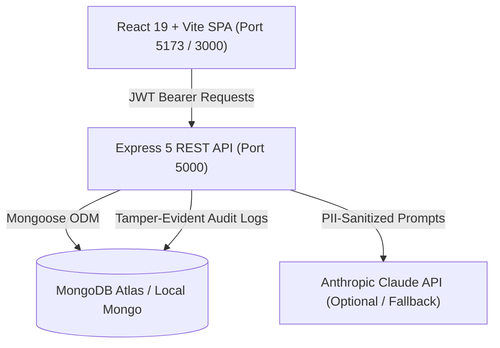

# BCA-05: Explainable Alumni-Mentor Matching Marketplace with Capacity-Aware Recommendations

> **Capstone Project BCA-05**  
> **Tech Stack:** React 19 + Vite, Node.js 22 + Express 5, MongoDB Atlas + Mongoose, JWT Auth, Docker, Claude AI.

---

## 1. Project Overview

**MentorConnect (BCA-05)** is a full-stack, enterprise-grade alumni-student mentorship marketplace engineered to solve critical bottlenecks in higher-education mentorship programmes:
1. **Black-box matchmaking:** Instead of opaque opaque recommendations, our system provides **100% explainable match scoring** with explicit, audited factor breakdowns (Skills 45%, Interests 20%, Goals 15%, Languages 10%, Availability 5%, Capacity 5%).
2. **Mentor burnout & overload:** Mentors define explicit capacity limits. The backend enforces **atomic concurrency guards** (`findOneAndUpdate` with `$expr`) preventing concurrent accepts from exceeding mentor capacity.
3. **Scheduling conflicts:** Server-side bidirectional scheduling ensures meetings fall strictly within published availability slots and blocks conflicting bookings for both participants.
4. **Responsible AI Integration:** AI services assist and explain match nuances, suggest SMART goals, and summarize feedback without ever silently overriding scores or processing student PII (Personally Identifiable Information). All AI features degrade gracefully to deterministic offline templates when API keys are absent.

---

## 2. System Architecture



### Backend Components
- **Express 5 REST API:** Modular routers for authentication, users, mentorship requests, meetings, goals, feedback, audit logs, and AI advisory services.
- **Explainable Matching Service:** `backend/services/matching.js` performs server-side Jaccard overlap and capacity-weighted scoring with immutable snapshot persistence.
- **Tamper-Evident Audit Ledger:** `backend/services/auditService.js` creates a cryptographically linked SHA-256 hash chain verifying data provenance and state transitions.
- **AI Advisory Service:** `backend/services/aiService.js` with structured prompt filtering and deterministic local heuristics fallback.
- **OpenAPI 3 / Swagger:** Live interactive API documentation hosted at `/api/docs`.

### Frontend Components
- **React 19 SPA:** Built with Vite, modern CSS variables, responsive design, and accessible component architecture.
- **Role-Based Workspaces:** Dedicated workflows for **Students**, **Alumni Mentors**, and **Administrators**.
- **Real-Time Data Hydration:** Automatic synchronization between backend REST endpoints and local reactive state.

---

## 3. Explainable Matching Algorithm

The matching engine calculates a transparent, deterministic score $S \in [0, 100]$:

$$\text{Score} = \sum_{i} w_i \cdot \text{RawScore}_i$$

| Factor | Weight ($w_i$) | Evaluation Method |
|---|---|---|
| **Skills Overlap** | 45% (0.45) | Jaccard-style normalized overlap of technical skills |
| **Interests** | 20% (0.20) | Intersection of student career domains & mentor domains |
| **Goals** | 15% (0.15) | Alignment between student growth targets & mentor offerings |
| **Languages** | 10% (0.10) | Common spoken communication languages |
| **Availability** | 5% (0.05) | Overlapping day/time availability slots |
| **Capacity** | 5% (0.05) | Full credit if $\text{currentMentees} < \text{capacity}$; 0% if at capacity |

Every score generates an immutable `matchSnapshot` recorded on the mentorship request, providing students and administrators with clear natural-language rationale for every match recommendation.

---

## 4. Getting Started

### Prerequisites
- Node.js 20+ or 22+ (LTS recommended)
- MongoDB Atlas account OR local MongoDB instance
- Docker & Docker Compose (optional for containerized deployment)

### Environment Setup

1. Copy and configure the environment files:
   ```bash
   # Root / Frontend
   cp .env.example .env

   # Backend
   cp backend/.env.example backend/.env
   ```

2. Edit `backend/.env` with your MongoDB connection string and a secure JWT secret:
   ```env
   PORT=5000
   MONGODB_URI=mongodb+srv://<username>:<password>@cluster.mongodb.net/alumni-mentor?retryWrites=true&w=majority
   JWT_SECRET=super_secret_jwt_key_at_least_32_characters_long
   CLIENT_URL=http://localhost:5173,http://localhost:3000
   ANTHROPIC_API_KEY=your_key_here # Optional
   ```

### Running Locally

```bash
# 1. Install frontend and backend dependencies
npm install
cd backend && npm install && cd ..

# 2. Start the Backend API (Port 5000)
cd backend
npm run dev

# 3. In another terminal, start the Frontend (Port 5173)
npm run dev
```

### Running with Docker Compose

```bash
docker-compose up --build
```
- Frontend: `http://localhost:3000`
- Backend API: `http://localhost:5000/api`
- Healthcheck: `http://localhost:5000/api/health`
- Swagger UI: `http://localhost:5000/api/docs`

---

## 5. Verification & Testing

```bash
# Run Vitest frontend suite (29 tests)
npm test

# Run Backend test suite (node:test + supertest)
cd backend && npm test
```

---

## 6. Academic Compliance & Integrity
- **No Hardcoded Secrets:** All secrets, keys, and tokens are read strictly from runtime environment variables.
- **Privacy First (Zero PII to AI):** Prompt serializers strip emails, phone numbers, and physical addresses before invoking external language models.
- **Deterministic Fallbacks:** The platform maintains 100% operational readiness even during network partitions or when AI services are unreachable.
