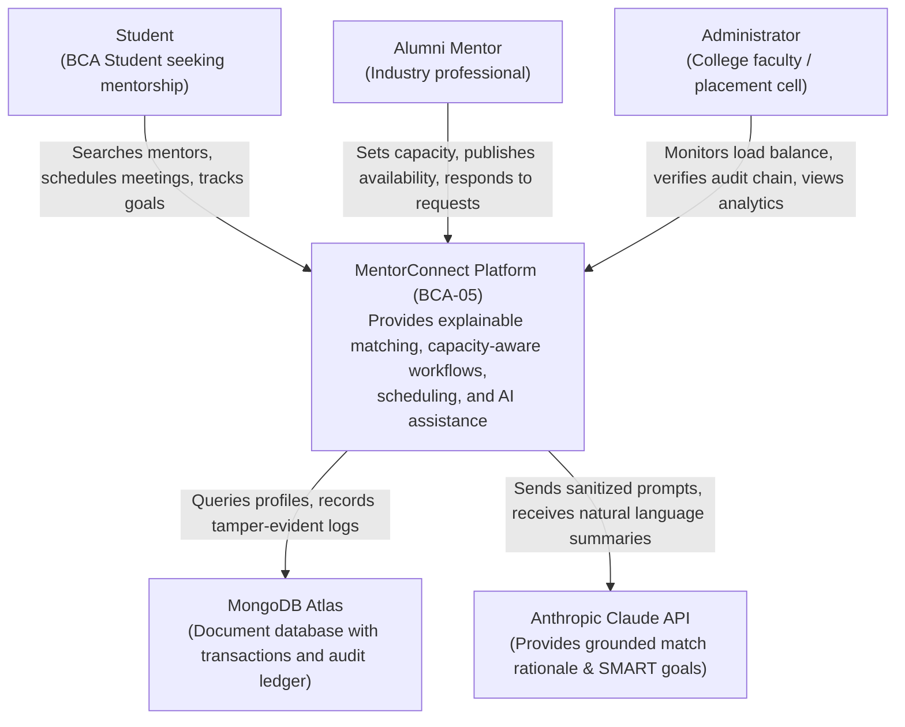
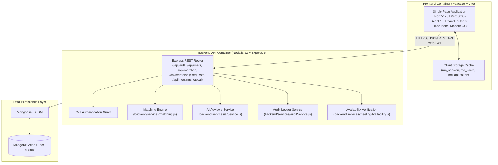
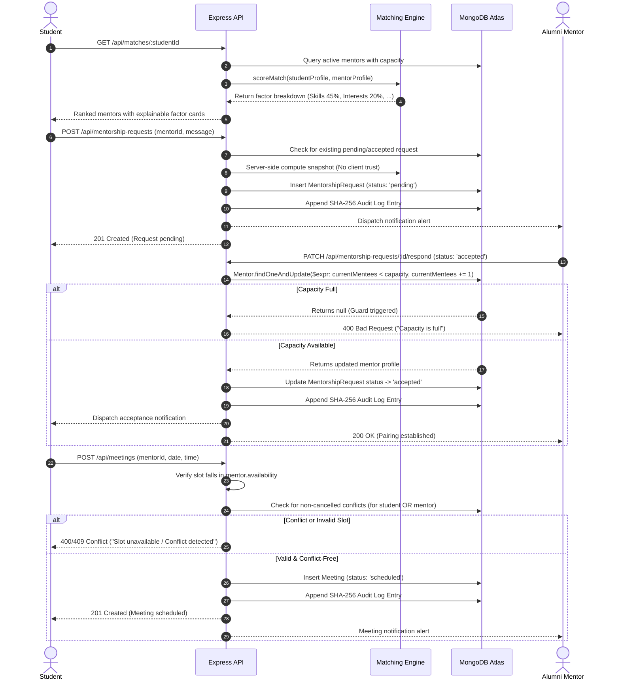

# System Architecture & Technical Design Document

> **Capstone Project BCA-05**  
> **System:** Explainable Alumni-Mentor Matching Marketplace with Capacity-Aware Recommendations  
> **Standard:** C4 Model & UML Sequence Workflows

---

## 1. C4 Context Diagram (Level 1)

---

## 2. C4 Container Diagram (Level 2)

---

## 3. Core Lifecycle Sequence Diagram (Request $\rightarrow$ Accept $\rightarrow$ Meeting)

---

## 4. Mathematical Definition of Match Scoring

$$S(u, m) = \min\left(100, \sum_{k \in \mathcal{F}} w_k \cdot R_k(u, m)\right)$$

Where:
- $\mathcal{F} = \{\text{skills}, \text{interests}, \text{goals}, \text{languages}, \text{availability}, \text{capacity}\}$
- $\sum_{k} w_k = 0.45 + 0.20 + 0.15 + 0.10 + 0.05 + 0.05 = 1.00$
- $R_k(u, m) = \frac{|\mathcal{S}_k(u) \cap \mathcal{M}_k(m)|}{\max(|\mathcal{S}_k(u)|, 1)} \times 100$ for overlap factors
- $R_{\text{capacity}}(u, m) = 100$ if $\text{currentMentees} < \text{capacity}$, else $0$
